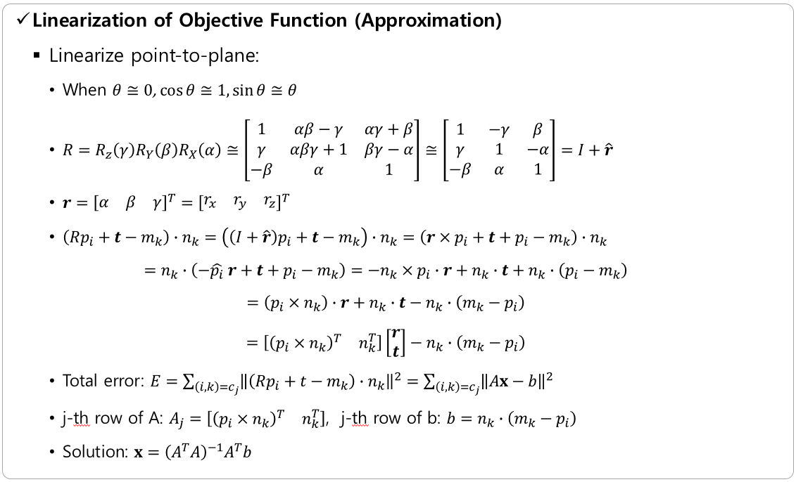
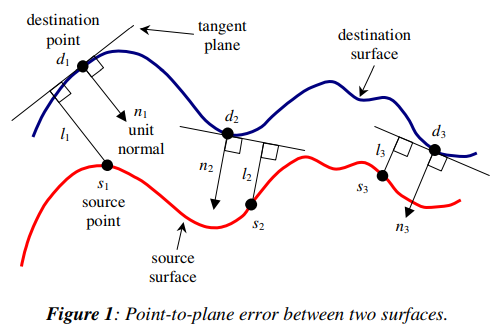
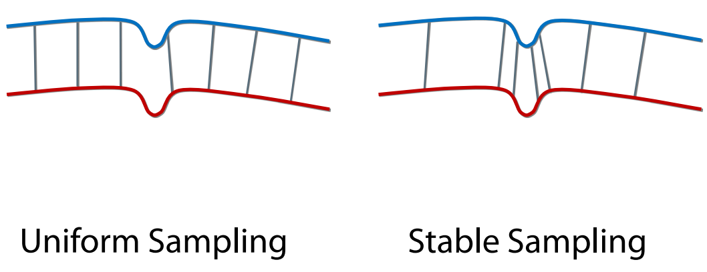
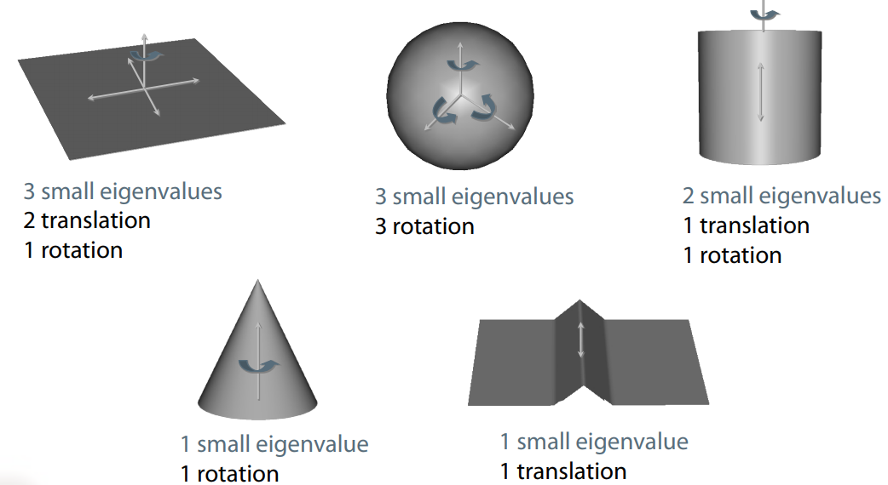
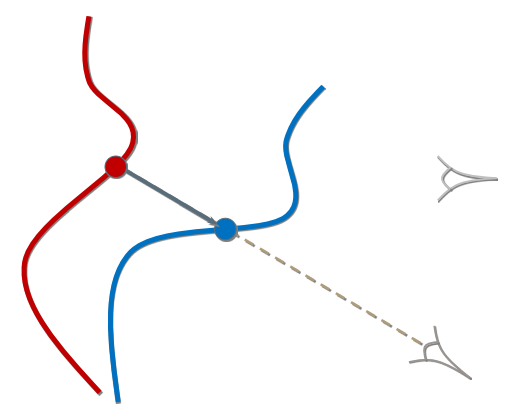

# Iterative Closest Point (ICP)

ICP는 두 개의 point cloud가 비슷한 모양을 가질 때 이 둘을 정합하는 (registration) 상대적인 pose (rotation + translation = rigid transformation)을 찾는 알고리즘이다. 단순히 거리 기반으로 point-to-point correspondence를 찾아 그 거리를 최소화하도록 최적화 하는 과정을 반복하기 때문에 이러한 이름이 붙었다.

## 1. Theory



참고: https://www.comp.nus.edu.sg/~lowkl/publications/lowk_point-to-plane_icp_techrep.pdf

## 2. Method

**문제 정의**
​	- Input argument: scene point cloud P (p_i, i=1,...,N_p), model point cloud M (m_k, k=1,...,N_m)
​	- Output: relative pose (rigid transformation)

ICP는 6단계의 알고리즘으로 쓸 수 있다.  
원문: https://docs.opencv.org/3.0-beta/modules/surface_matching/doc/surface_matching.html  
문서에 붙어 있는 reference paper도 봐두자. 논문을 보고 공부하는 것도 좋고 논문쓸 때 ICP에 대한 reference가 필요할 수 있다.

#### 1. Sampling
  - scene point p_i 에 대해 model point cloud 와 점대점 매칭을 하기 때문에 점의 수에 비례해서 속도가 느려진다.
  - 점의 수가 많을 때는 다운샘플링을 해도 그다지 성능 저하가 일어나지 않는다. 
  - Naive한 Uniform Sampling을 해도 되지만 좀 더 스마트한 방법은 normal vector의 분포가 균일해지도록 맞추는 것이다.
  - 상대적인 3차원 pose를 구하기 위해서는 최소 3가지 방향으로 끌어당기는 힘이 필요하다.
  - 어느 한쪽의 인력이 과도하고 다른 방향의 인력이 약하다면 인력이 강한쪽만 정확히 정합이 되고 약한 쪽은 정합이 안된채로 끝나버린다.
  - 그래서 세 방향의 인력이 균일하도록 샘플링을 하면 효율적이고 효과적인 샘플링을 할 수 있다.
  - 효율적: 넓은 평면의 점들은 듬성듬성하게 뽑아도 된다.
  - 효과적: 모든 점을 활용할 때보다 더 정확한 정합을 찾을 수 있다.
  - 참고: https://ieeexplore.ieee.org/document/1240258
    
    
#### 2. Correspondence Search
  - (I)CP 이름 그대로 가장 가까운 점들을 매칭한다.
  - 모든 scene point p_i 에 대해 공간상에서 가장 가까운 model point m_k 를 찾아서  return {(i, k)}
  - ICP에서 가장 많은 시간을 먹는 단계: 기본적으로는 O(n^2), 검색 범위를 좁히면 O(nm)
  - 모든 scene point p_i 에 대해 correspondence를 찾는 것보다 서로 1:1 매칭만을 찾는 것이 더 효율적이다.
  - 입력 데이터가 unordered point cloud로 주어진 경우 3차원 공간에서 점 사이의 거리를 측정하여 correpondence를 구하지만 depth map 처럼 ordered point cloud로 주어진 경우에는 reprojection을 이용한 방법이 효율적이다.
  - depth map으로 주어지고 카메라의 이동이 크지 않은 경우, 현재까지 측정한 상대 pose에서 model point cloud를 reprojection 하며 scene point cloud 와의 correspondence 구할 수 있음
  - 매칭 시간이 점의 개수에 선형 비례하지만 iteration을 더 많이 돌아야 한다.
      
  - color 정보를 이용해서 매칭에 도움을 줄 수 있다.
#### 3. Weighting of Pairs
  - 현재 normal vector의 방향이 비슷하거나, 거리가 가까운 점들에 더 많은 가중치를 줄 수 있다.
#### 4. Rejection of Pairs
  - scene point 를 기준으로 무조건 가장 가까운 correspodence 들을 다 쓰는 것은 아니다. 거리가 너무 먼 것을 쓰지 않는다. Iteration이 반복되면서 두 개의 모양이 점점 가까워지므로 Threshold를 지속적으로 줄인다.
#### 5. Error Minimization
  - Error metric은 크게 point-to-point distance와 point-to-plane distance가 있는데 일반적으로 point-to-plane distance의 성능이 더 좋다.

  - point-to-point distance: 점과 점사이의 직선거리

  - point-to-plane distance: 한점을 다른 점이 속한 평면에 내린 직선거리

#### 6. Convergence Criteria
  - 에러가 줄어들다가 더이상 줄어들지 않고 수렴하게 되면 현재까지 추정한 pose를 출력하고 그렇지 않으면 다시 2번부터 반복한다.

## 3. Open3D Implemetation

```cpp
RegistrationResult RegistrationICP(const PointCloud &source,
        const PointCloud &target, double max_correspondence_distance,
        const Eigen::Matrix4d &init/* = Eigen::Matrix4d::Identity()*/,
        const TransformationEstimation &estimation
        /* = TransformationEstimationPointToPoint(false)*/,
        const ICPConvergenceCriteria &criteria/* = ICPConvergenceCriteria()*/)
{
    if (max_correspondence_distance <= 0.0) {
        PrintError("Error: Invalid max_correspondence_distance.\n");
        return RegistrationResult(init);
    }
    if (estimation.GetTransformationEstimationType() ==
            TransformationEstimationType::PointToPlane &&
            (!source.HasNormals() || !target.HasNormals())) {
        PrintError("Error: TransformationEstimationPointToPlane requires pre-computed normal vectors.\n");
        return RegistrationResult(init);
    }

    Eigen::Matrix4d transformation = init;
    KDTreeFlann kdtree;
    kdtree.SetGeometry(target);
    PointCloud pcd = source;
    if (init.isIdentity() == false) {
        pcd.Transform(init);
    }
    RegistrationResult result;
    result = GetRegistrationResultAndCorrespondences(
            pcd, target, kdtree, max_correspondence_distance, transformation);
    for (int i = 0; i < criteria.max_iteration_; i++) {
        PrintDebug("ICP Iteration #%d: Fitness %.4f, RMSE %.4f\n", i,
                result.fitness_, result.inlier_rmse_);
        Eigen::Matrix4d update = estimation.ComputeTransformation(
                pcd, target, result.correspondence_set_);
        transformation = update * transformation;
        pcd.Transform(update);
        RegistrationResult backup = result;
        result = GetRegistrationResultAndCorrespondences(pcd,
                target, kdtree, max_correspondence_distance, transformation);
        if (std::abs(backup.fitness_ - result.fitness_) <
                criteria.relative_fitness_ && std::abs(backup.inlier_rmse_ -
                result.inlier_rmse_) < criteria.relative_rmse_) {
            break;
        }
    }
    return result;
}
```
